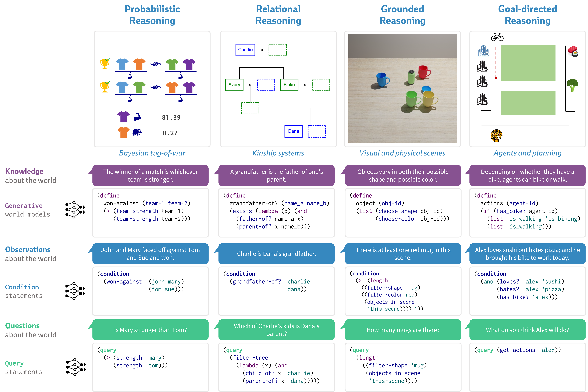
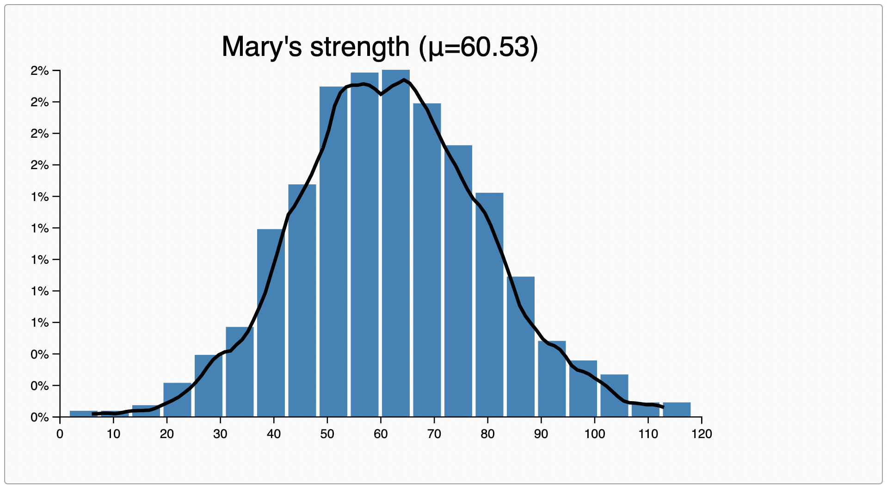
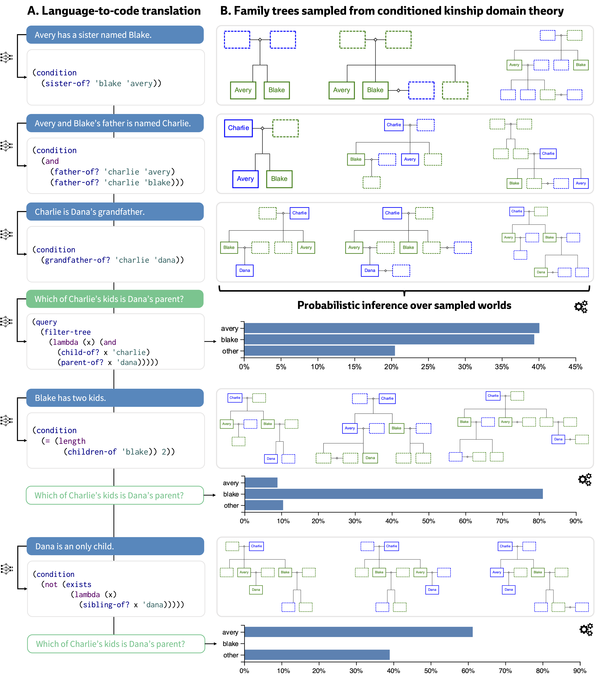
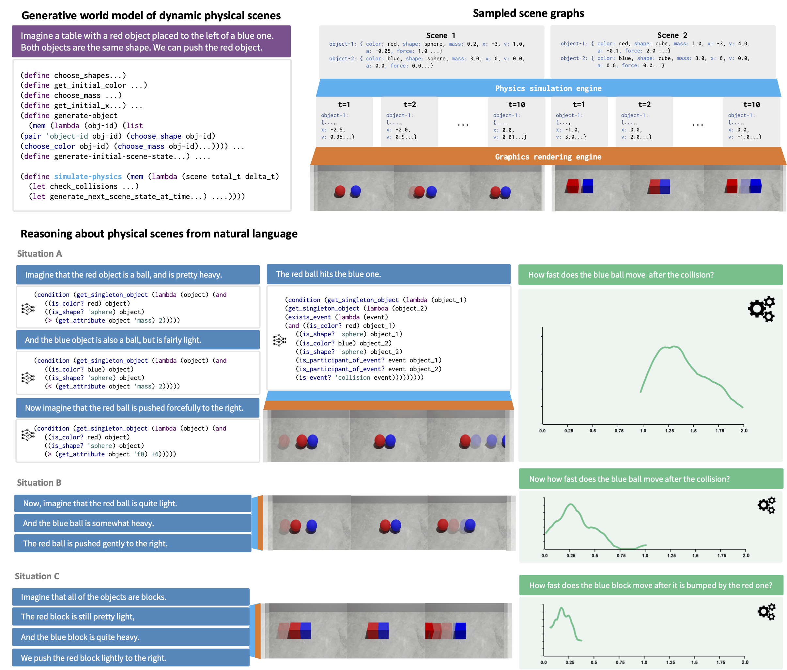
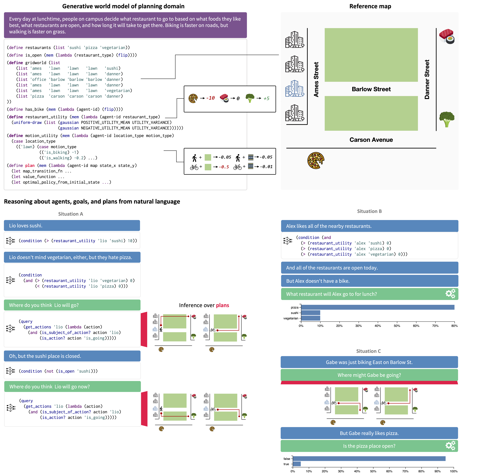

# From Word Models to World Models: Translating from Natural Language to the Probabilistic Language of Thought

Full paper: https://arxiv.org/abs/2306.12672

### Abstract

How does language inform our downstream thinking? In particular, how do humans make meaning from language — and how can we leverage a theory of linguistic meaning to build machines that think in more human-like ways?
In this paper, we propose _rational meaning construction_, a computational framework for language-informed thinking that combines neural models of language with probabilistic models for rational inference. We frame linguistic meaning as a context-sensitive mapping from natural language into a _probabilistic language of thought_ (PLoT) — a general-purpose symbolic substrate for probabilistic, generative world modeling. Our architecture integrates two powerful computational tools that have not previously come together: we model thinking with _probabilistic programs_, an expressive representation for flexible commonsense reasoning; and we model meaning construction with _large language models_ (LLMs), which support broad-coverage translation from natural language utterances to code expressions in a probabilistic programming language.
We illustrate our framework in action through examples covering four core domains from  cognitive science: probabilistic reasoning, logical and relational reasoning, visual and physical reasoning, and social reasoning about agents and their plans. In each, we show that LLMs can generate context-sensitive translations that capture pragmatically-appropriate linguistic meanings, while Bayesian inference with the generated programs supports coherent and robust commonsense reasoning. We extend our framework to integrate cognitively-motivated symbolic modules (physics simulators, graphics engines, and goal-directed planning algorithms) to provide a unified commonsense thinking interface from language. Finally, we explore how language can drive the construction of world models themselves.
We hope this work will help to situate contemporary developments in LLMs within a broader cognitive picture of human language and intelligence, providing a roadmap towards AI systems that synthesize the insights of both modern and classical computational perspectives.

### What code is included in this repository?
This repo is an archival collection of code files that were used to generate the examples in our paper. For now, this code is intended to be run manually in the playground settings described below. However, as next steps, we believe our framework naturally suggests many kinds of concrete implementations that function end-to-end as natural dialogue systems capable of complex, probabilistic reasoning.

# Framework overview

 **Meaning function**: Context-sensitive mapping from natural language to code expressions.

 **Inference function**: Sample-based probabilistic inference engine over possible worlds described by a generative model.

## Experimenting with a meaning function

For the examples we present in our paper, we use OpenAI's Codex model to play the role of the meaning function. Everywhere that a  symbol appears indicates a translation produced by Codex. To reproduce these translations, you can use the [OpenAI Playground](https://platform.openai.com/playground) (account required to access) or the [ChatGPT interface](https://chat.openai.com/). For each domain, the `prompt.scm` file contains the text that was used for prompting.

## Experimenting with an inference function

In our paper, we used a probabilistic programming languguage called [Church](https://v1.probmods.org) to play the role of the inference function. Everywhere that a  symbol appears indicates a  computation that was performed with Church's probabilistic inference engine. To reproduce these inferences, you can use the [Church Play Space](https://v1.probmods.org/play-space.html). For each domain, the `world-model.scm` file contains generative model in Church that can be pasted directly into the editor.

# Domains



## Probabilistic reasoning

Code: [[Domain 1] Probabilistic reasoning](domains/d1-probabilistic-reasoning)

As an introductory example, we consider the Bayesian Tug-of-War (Gerstenberg & Goodman, 2012; Goodman et al., 2014). We start with a generative model of a tournament in which players of varying strengths compete in a series of matches as part of fluid teams. Each player has a latent strength value randomly sampled from a Gaussian distribution (with parameters arbitrarily chosen as μ = 50 and σ = 20). As an observer, our goal is to infer the latent strength of each individual based on their win/loss record. However, players sometimes don’t pull at their full strength and each player has a different intrinsic “laziness” value (uniformly sampled from the interval [0, 1]) that describes how likely they are to be lethargic in a given match.

As a simple example, suppose we observe two matches. In the first match, Tom won against John. In the second match, John and Mary won against Tom and Sue. We can encode both of these observations as the following Church conditioning statement.

```
(condition
  (and
    ;; Condition: Tom won against John.
    (won-against '(tom) '(john))
    ;; Condition: John and Mary won against Tom and Sue.
    (won-against '(john mary) '(tom sue))))
```

Based on the fact that Tom won against John, we might expect Tom to be stronger than John. Therefore, the fact that John and Mary won against Tom and Sue suggests that Mary's strength is above average. We can replicate this probabilistic inference with the following Church query:

```
;; Query: How strong is Mary?
(strength 'mary)
```



This is just a simple example of the kinds of probabilistic inferences we can make in the Bayesian tug-of-war. In our paper, we consider more complex observations (e.g., "Josh has a propensity to slack off") and inferences (e.g., "Is Gabe stronger than the weakest player on the faculty team?"), before scaling up to new domains of reasoning.

## Relational reasoning

Code: [[Domain 2] Relational reasoning](domains/d2-relational-reasoning)

Next, we consider _relational reasoning_ characteristic of "good old fashioned" AI systems like Prolog. Our domain of interest is **kinship**: tree-structured relationships between people in a family. Our world model is a probabilistic generative model over family trees, and our conditioning and query statements are propositions about relations between people (e.g., "Charlie is the grandfather of Dana"). Through the examples in our paper, we illustrate how our approach of translating from natural language to the probabilistic language-of-thought fluidly integrates both exact (logical) and fuzzy (probabilistic) reasoning in a way that comes naturally to people, but that has so far proven elusive for both traditional deductive programming systems and purely statistical language models.



## Grounded visual reasoning

Code: [[Domain 3] Grounded visual reasoning](domains/d3-grounded-visual-reasoning)

How can we flexibly relate language to our more general perceptual and physical reasoning? By incorporating external graphics and physics engines, these sections blueprint how computational models that ground linguistic meaning in a probabilistic language-of-thought can interface with other cognitive modules for perception and physical reasoning.

### Static scenes
In [static-scenes](domains/d3-grounded-visual-reasoning/static-scenes), we extend our framework to integrate a graphics rendering engine to relate linguistic meanings to visual knowledge. Our world model is a probabilistic generative model over objects on a tabletop. Conditioning statements convey information about the type, color, number, and other properties of these objects; queries are questions about the contents of the scene (e.g., "Are there more red objects or green ones?").


### Dynamic scenes
Next, in [dynamic-scenes](domains/d3-grounded-visual-reasoning/dynamic-scenes), we integrate a physics simulation engine to further interface between language and intuitive, probabilistic physical reasoning. We extend our tabletop world model to include information about object masses and velocities. Based on the initial world state, we iteratively run a simple Newtonian dynamics model to compute a timeseries of trajectories. Conditioning statements encode information about both initial world states (e.g., "The red ball is pretty heavy") and events (e.g., "The red ball hits the blue one"). Queries invoke inferences about these world states (e.g., "How fast does the blue ball move after the collision?").



## Goal-directed reasoning

Code: [[Domain 4] Goal-directed reasoning reasoning](domains/d4-goal-directed-reasoning)

In our final example, we explore language about other social beings – agents who want things, chase goals, and plan how to act in the world around them. We consider a gridworld domain based on C. L. Baker, Tenenbaum, and Saxe (2007) involving agents with different preferences and goals who are making lunch plans. We extend our framework to include a _model-based planner_ that supports inferences about agents' actions (e.g., "Lio loves sushi but hates pizza; where do you think they will go?"). We also illustrate how our probabilistic framing supports _inverse planning_: making inferences about agents' value functions and the state of the world, given observed actions (e.g., "Gabe was just biking East on Barlow Street; do you think the pizza place is open? Do you think he likes pizza?"). All of these inferences fall out of the same underlying generative model, which unifies these distinct observations about people and the world in language with respect to a formal model of how agents tend to behave.




